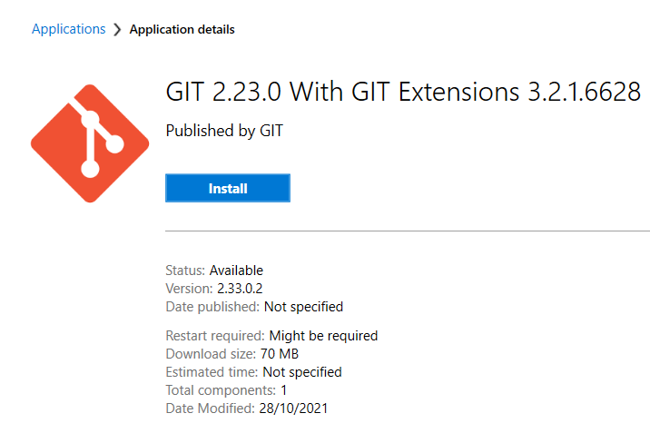

# GitHub Pages Creation using Jekyll and Just the Docs

  

    Table of contents
  

  {: .text-delta }
1. TOC
{:toc}

## Introduction

This is a guide for creating webpages to host on GitHub Pages using a markdown editor and Jekyll.

Prerequisites:

- Jekyll <https://jekyllrb.com/docs/>
- Ruby (required for Jekyll) <https://rubyinstaller.org/downloads/>
- Microsoft Visual Studio <https://visualstudio.microsoft.com/downloads/>
- Github Desktop <https://desktop.github.com/>
- Just the Docs Template <https://pmarsceill.github.io/just-the-docs/>
- MathJax – addon for Jekyll which provides useful equation editing capability

## Installation Guide (Windows)

This guide is designed for installing and configuring the required software on a LU IT Services managed Windows based PC.

### Installing Ruby and Jekyll

Link for install: <https://jekyllrb.com/docs/>

There is a specific set of instructions to install on a Windows PC (Windows is not an officially supported platform – however this has been shown to work): <https://jekyllrb.com/docs/installation/windows/>

To download Ruby go to: <https://rubyinstaller.org/downloads/>

Download the latest 64bit version WITH DEVKIT. Copy from the Downloads folder to a folder on the root of the C drive e.g. C:\software.
Run the installer with the default settings.

Make sure to enable the option to Run ‘ridk install’:

The installer will open a CMD window:

You just need to press ENTER to install the default required packages.

Open a command prompt and type the following to install Jekyll and the Bundler:
gem install jekyll bundler

Once completed, check Jekyll has installed with the command: jekyll - v

Jekyll should now be installed. However, there are some more command line steps to configure to use to develop GitHub Pages with the Just the Docs template… (to be updated)….

### Installing Visual Studio

Download and install the latest version of Visual Studio (if not installed on your PC), link: <https://visualstudio.microsoft.com/downloads/>

You should sign in with an account (can use your University Microsoft account e.g. your Univerity account). Refer to this page for more information:
<https://docs.microsoft.com/en-us/visualstudio/ide/signing-in-to-visual-studio?view=vs-2022#how-to-sign-in-to-visual-studio>

Once signed in, you can then open a local project. This can be a GitHub repository cloned from GitHub or a new project.

### Installing GitHub Desktop

Website: <https://desktop.github.com/>

Note: This app is not available on the LU University Software Centre.

To install GitHub Desktop on a university managed PC: download GitHub Desktop from the above link then move the installer out of the Downloads folder to a folder on the root of the C drive or on the second HDD (if fitted). You can then launch the installer.  If you try to run the installer from the Downloads folder, it will be blocked by the IT Services.

Once installed, sign-in with your exiting GitHub account or create a new one.

Once GitHub Desktop is set-up, you can start by making a clone of the project hosted by BM on GitHub apco-docs:

Note: The University Software Centre does have GIT:

## Windows Command Line – Additional steps needed to configure PC

After installing the prerequisites following the above guide and downloading a copy of the ‘apco-docs’ repository, there are several further steps potentially required to get set-up to create webpages with Jekyll on the PC.

These additional steps need to be done using a command line terminal in Windows.

First, let us confirm that the Jekyll web server cannot start without some additional steps.

Open a command line terminal in Windows (click on the start button and type ‘cmd’ and then click on the Command Prompt).
Navigate to the ‘docs’ sub-folder in the ‘apco-docs’ repository. e.g. if repository is on a different drive to C:

Type the Jekyll webserver command: ‘bundle exec Jekyll serve’ and press enter:

You will likely see the above ‘error’ which means that the ‘just-the-docs’ template used with ‘apco-docs’ is not installed.

To install the ‘just-the-docs’ template, enter the command: ‘gem install just-the-docs’ and press enter:

This should install as shown above.

Now try to run the Jekyll command as above again:

You may now get the ‘error’ ‘github-pages’ is missing.

You can try and fix this by running the command: ‘gem install github-pages’ and press enter:

This may take a few minutes and a lot of lines will appear on the terminal window, be patient. If this completes OK the terminal window should return something similar to below:

Now try to run the Jekyll command as above again:

Again, this is showing that another component is required.

To fix this, follow the prompt and run the command: ‘bundle install’ and press enter. Like for github-pages, this may take a few minutes and generate lots of lines in the command terminal.

When this finishes, the terminal will look like the following and return the user prompt:

Now try to run the Jekyll command as above again:

This time the ‘error’ is the missing ‘webrick’ files. To fix this, run the command: ‘bundle add webrick’ and press enter. Another long list of entries will show in the command window as this processes:

When the terminal prompt is returned to the user, run the Jekyll command again e.g:

This time hopefully the command will work and a ‘Server Address’ (local webpages hosted on the PC) will be created which you can then check in your browser to see the website on the local webserver.

You should follow the prompt in the terminal window to stop this local webserver when you are done with the website.

The above steps were what was necessary to get this Jekyll command to work on a Windows 11 PC (in late 2021) after going through the earlier prerequisites. It is possible/probable that this experience may be different on another PC, especially if different versions of the prerequisites are used.

If so, the user is advised to install the missing packages/components following the prompts in the terminal window after each attempt to run the Jekyll command, as shown above. Errors different to the above, are outside the scope of this guide.

After this is done once, hopefully it will not be necessary to do this again!

## Windows Command line – how to run the Jekyll command to create a local webserver

Open a command line terminal in Windows (click on the start button and type ‘cmd’ and then click on the Command Prompt). Navigate to the ‘docs’ sub-folder in the ‘apco-docs’ repository. e.g. if repository is on a different drive to C:
  

Type the Jekyll webserver command: 'bundle exec Jekyll serve'

If everything is configured correctly on the PC and the local ‘apco-docs’ repository is OK, something like the following should appear after the command:

You can then navigate with a browser to the server address to view how the current website looks:

Tip: alternatively you can pass the '--livereload' option to serve to automatically refresh the page with each change you make to the source files e.g. : 'bundle exec jekyll serve --livereload'

To stop the remote server, type ctrl C. You can then close the server by typing Y and enter. Note due to a bug in ‘apro-docs’ you may get an error and you will need to type Y and enter again to close the web server:

If you now try to refresh the webpage you will get an error:

Seeing this error confirms the local webserver has shut down OK.

## Visual Studio – how to try and run the Jekyll command to create a local webserver

Step 1: Open a terminal window inside of Visual Studio, click on View and click on Terminal:

Step 2: navigate to the ‘docs’ directory inside ‘apco docs’ (the template created by BM) and then run the Jekyll command: ‘bundle exec Jekyll serve’

For an unknown reason this command failed (as above).

So it was not possible to launch the local web server from the command line in Visual Studio.

The reason for this not working requires further investigation, likely a set-up issue or a missing component. It is known to work on a MAC OK (BM uses this method).

## Jekyll Markdown - basic formatting guide

This is some examples of basic Jekyll markdown stled elements.

This guide was adapted from here:
<https://raw.githubusercontent.com/barryclark/www.jekyllnow.com/gh-pages/_posts/2014-6-19-Markdown-Style-Guide.md>

This is a paragraph, it's surrounded by whitespace. Next up are some headers, they're heavily influenced by GitHub's markdown style.

## Header 2 (H1 is reserved for post titles)##
{: .no_toc }
### Header 3
{: .no_toc }
#### Header 4
{: .no_toc }

A link to [Jekyll Now]

link <http://github.com/barryclark/jekyll-now/>

Examples - lists:

* A bulletted list
- alternative syntax 1
+ alternative syntax 2
  - an indented list item

1. An
2. ordered
3. list

Inline markup styles: 
- _italics_
- **bold**
- `code()` 
 > Blockquote
>> Nested Blockquote 

 Syntax highlighting can be used by wrapping your code in a liquid tag like so:
{{ "  
/* Some pointless Javascript */
var rawr = ["r", "a", "w", "r"];
{{ "  

creates...

/* Some pointless Javascript */
var rawr = ["r", "a", "w", "r"];

 
Use two trailing spaces  
on the right  
to create linebreak tags  
 
Finally, horizontal lines
 
----
****

Example how to do a simple figure insert:

1). Original figure with no format commands:

2). Figure adjusted to a specific size:

----
  
  

## Original page from BM
{: .no_toc }

This is the landing page (which becomes index.html).

The folders notes and labs are just to keep content separate.

The website structure is defined by the first few lines of each file between the "---" (folders are ignored).

- layout: home for index.html (this one) or page or default
- nav_order: order in navigation menu to the left of the page
- parent: for child doc name of the parent
- has_children: true or false
- use_mathjax: equations are rendered using mathjax if their are equations on the page then this should be set to true.
